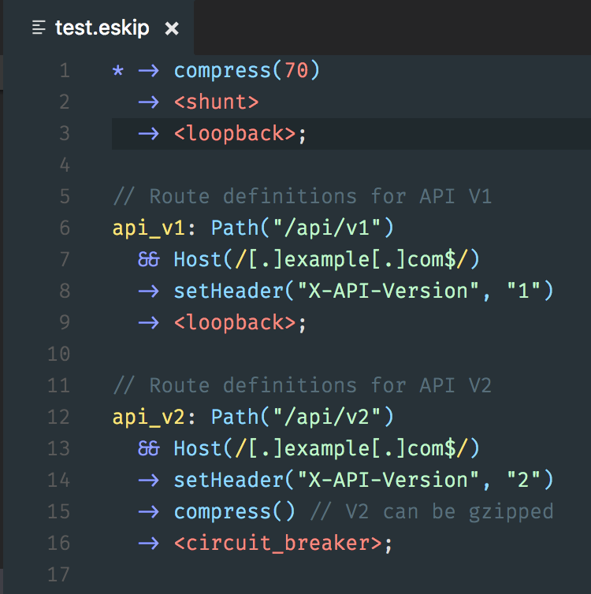
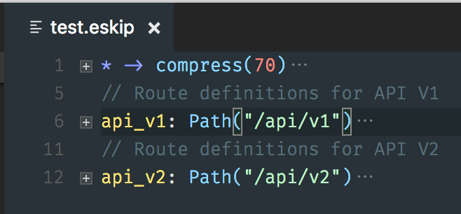
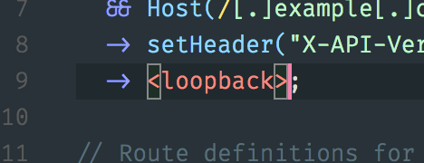

# vscode-eskip

VSCode Language extension for eskip file of [Skipper](https://github.com/zalando/skipper)

## Install

https://marketplace.visualstudio.com/items?itemName=boopathi.eskip

## Features

### Syntax Highlighting

### Collapsing definitions

### Matching brackets

